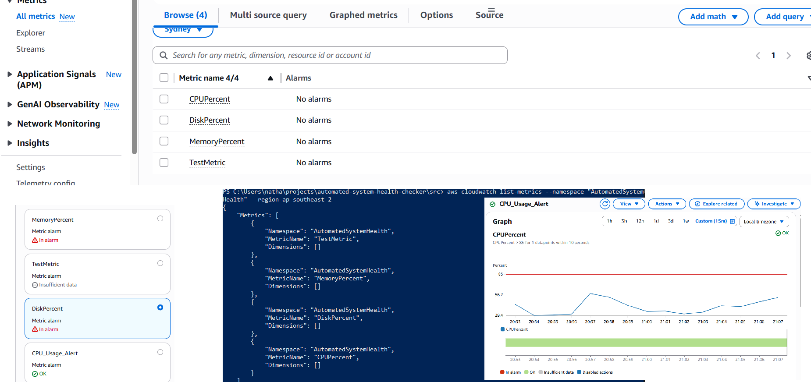

# 🚨 Automated System Health Checker

**Python-based system monitoring tool that tracks system performance and sends metrics & logs to AWS CloudWatch.**

---

## 📝 Overview




The **Automated System Health Checker** is a Python script designed to monitor your system’s health in real-time. It collects key performance metrics such as CPU usage, memory utilization, and disk usage, then sends them to **AWS CloudWatch** for centralized monitoring and alerting.  

This tool helps you:  
- Detect performance bottlenecks early  
- Track system metrics over time  
- Set up alarms for potential issues  
- Ensure high availability and reliability of your systems  

---

## ⚡ Features

- Monitors **CPU**, **Memory**, **Disk**, and **custom metrics**  
- Sends system metrics directly to **AWS CloudWatch**  
- Configurable alarms for thresholds  
- Lightweight and easy to deploy  
- Cross-platform support (Windows & Linux)  

---

## 🛠️ Installation

1. **Clone the repository**  
```bash
git clone https://github.com/Nathsuuuu/automated-system-health-checker.git
cd automated-system-health-checker
